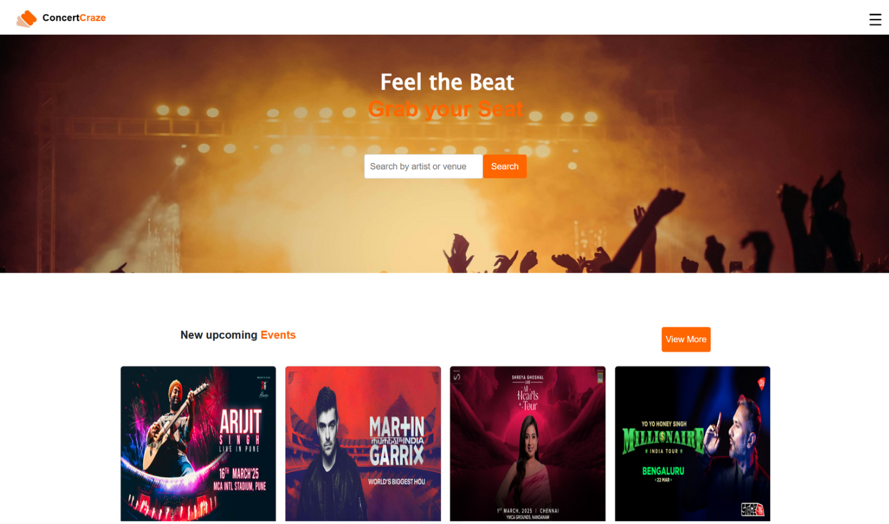
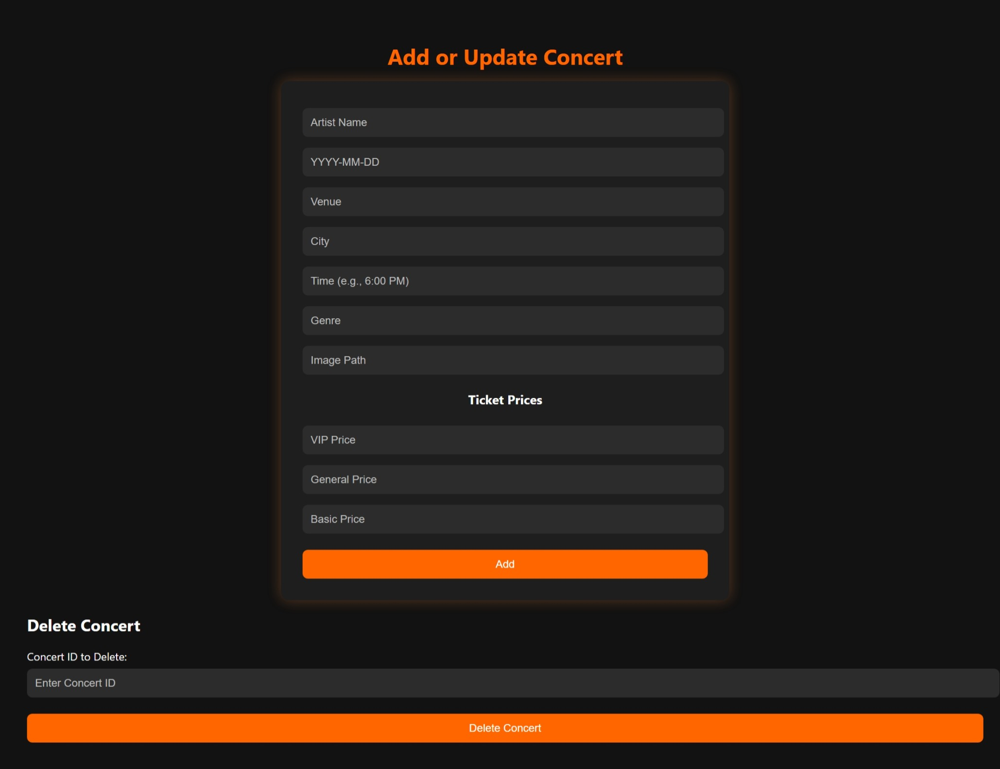
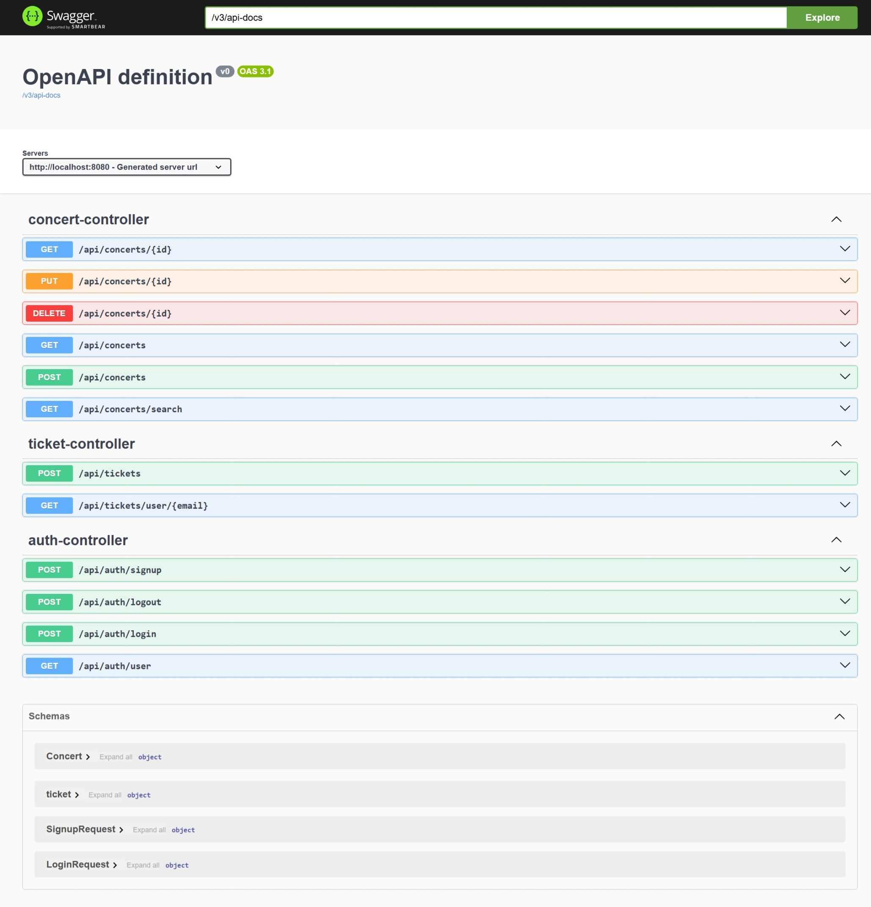

# 🎸 Concert Craze – Concert Ticket Booking Website

Concert Craze is a full-stack **concert ticket booking platform** inspired by platforms like BookMyShow. Users can browse upcoming concerts, search by artist or venue, view details, and book tickets.

---

## 🛠️ Tech Stack

- **Frontend**: HTML, CSS, JavaScript (Vanilla)
- **Backend**: Java Spring Boot (RESTful API)
- **Database**: MySQL
- **API Testing**: Postman
- **API Documentation**: Swagger

---

## 🔍 Key Features

- 🎤 Search concerts by **artist**, **venue**, **genre**
- 🧾 Ticket confirmation and booking history
- 🛂 Admin panel to **add/update/delete** concert events (CRUD)
- 📄 API endpoints tested with Postman and documented with Swagger

---

## 🧱 Project Architecture

### 🧩 Model Layer
- Domain classes: `Concert.java`, `User.java`, `Ticket.java`
- Uses `@Entity` to map Java objects to DB tables
- Example: `Map<String, Integer>` to store ticket price categories

### 🌐 Controller Layer
- Handles HTTP requests (`GET`, `POST`, `PUT`, `DELETE`)
- Endpoints for concerts, users, tickets, and admin operations

### ⚙️ Service Layer
- Contains business logic: concert filtering, seat booking, pricing logic
- Called by the controller layer

### 🗃️ Repository Layer
- Uses Spring Data JPA (`JpaRepository`)
- Interfaces with the MySQL database

---

## 📘 Documentation

- **ER Diagram**: [View ER Diagram](https://docs.google.com/document/d/12ijJc4_Xcke4Fj18-fr4THZdbfarq2vo9DoxuV8cN9g/edit?usp=sharing)
- **Architecture Diagram**: [View Architecture](https://docs.google.com/document/d/1O3opYtxxhXzqpzHZaSKCkpvD8FJBjsaM0q-npIpYekA/edit?usp=sharing)

---

## UI Preview

### Home Page

### Admin Page

### Swagger Status (Current Dev Status)

---

## 🎟️ Booking Flow

1. User logs in or signs up
2. Searches available concerts
3. Views concert details and ticket categories
4. Selects desired ticket(s)
5. Books the concert (saved in DB and confirmed)
6. View booked concerts on my tickets page

---

## 🧪 API Testing

- Use **Postman** for manual endpoint testing

---

## 🙌 What I Learned

- Built and connected a **full-stack concert ticket booking system**
- Implemented a **custom login and signup flow** with:
  - User authentication
  - Password hashing using **BCrypt**
- Used **Spring Boot's layered architecture**: Controller → Service → Repository
- Created a working **CRUD admin panel** with input validation
- Fetched and rendered dynamic concert data using **vanilla JavaScript**

## Contact

For any queries, feel free to reach out at [zahidhussain6143@gmail.com].

---
